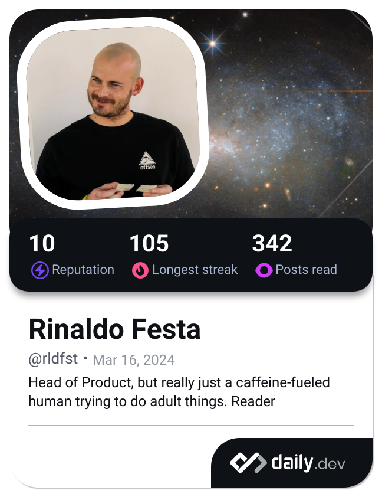

###

  
  
  

###

<h1 align="left">Hey 👋 What's up?</h1>

###

My name is Rinaldo and I'm just a caffeine-fueled human trying to do adult things. Reader, to balance out madness. Lifelong-Learner.

For as long as I can remember, I have had a keen interest in software and computers. I started programming at the age of 12, but eventually got bored and stopped.

Now I'm learning again in my 30s.

###

<h2 align="left">About me</h2>

###

🎲 Head of Product @Cosmico 📚 Passionate about AI & Software Engineering. 🎯 I started my programming journey in 2023 just for fun

###

<h2 align="left">I'm learning to code with</h2>

###

  
  
  
  
  
  
  
  
  
  
  
  

###

###

  
  

###
